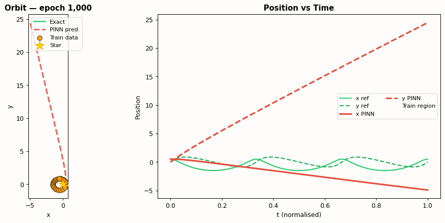

# 🪐 Physics-Informed Neural Network — Kepler Orbit Reconstruction

<p align="center">
  
</p>

<p align="center">
  
  
  
  
</p>

---

## 🌌 Overview

This project applies **Physics-Informed Neural Networks (PINNs)** to reconstruct a **Kepler elliptical orbit** from sparse observational data — using Newton's law of gravitation as a physics constraint.

**Problem Statement:**  
> A satellite is observed for only **40% of its orbit**. Can a neural network predict the remaining trajectory?

- ❌ **Standard NN** — interpolates data but extrapolates incorrectly (doesn't know about closed ellipses)
- ✅ **PINN** — constrained by Newton's gravity, reconstructs the complete ellipse correctly

---

## 🔭 The Physics

The two-body gravitational problem in dimensionless units ($GM = 1$):

$$\ddot{x} = -\frac{GM \cdot x}{r^3}, \qquad \ddot{y} = -\frac{GM \cdot y}{r^3}, \qquad r = \sqrt{x^2 + y^2}$$

This system has two conserved quantities (Kepler's laws):

$$E = \frac{1}{2}(v_x^2 + v_y^2) - \frac{GM}{r} = \text{const} \quad \text{(energy)}$$
$$L = x v_y - y v_x = \text{const} \quad \text{(angular momentum — Kepler's 2nd law)}$$

---

## 🧠 PINN Loss Function

$$\mathcal{L}_{\text{total}} = \underbrace{\frac{1}{N}\sum_{i}\left[(\hat{x}(t_i)-x_i)^2 + (\hat{y}(t_i)-y_i)^2\right]}_{\text{data loss}} + \lambda \underbrace{\frac{1}{M}\sum_{j}\left[\left(\ddot{\hat{x}} + \frac{GM\hat{x}}{r^3}\right)^2 + \left(\ddot{\hat{y}} + \frac{GM\hat{y}}{r^3}\right)^2\right]}_{\text{physics (ODE residual) loss}}$$

Second derivatives $\ddot{\hat{x}}, \ddot{\hat{y}}$ are computed via **PyTorch autograd** — fully differentiable, trainable end-to-end.

---

## 🗂️ Repository Structure

```
Physics_Informed_NN-Kepler-main/
├── Kepler_PINN_Walkthrough.ipynb   ← 📓 Comprehensive Jupyter notebook
├── Kepler_PINN.py                  ← 🐍 Standalone Python script
├── plots/                          ← 📊 Generated plots
├── nn_kepler.gif                   ← Standard NN training animation
├── pinn_kepler.gif                 ← PINN training animation
└── README.md
```

---

## 🚀 Quick Start

### 1. Install dependencies
```bash
pip install torch numpy scipy matplotlib pillow jupyter
```

### 2. Run the Python script
```bash
mkdir -p plots
python Kepler_PINN.py
```

### 3. Explore the Jupyter notebook
```bash
jupyter notebook Kepler_PINN_Walkthrough.ipynb
```

---

## 📊 Results at a Glance

| Method | Training Region MAE | Extrapolation MAE |
|--------|--------------------|--------------------|
| Standard NN | ~0.005 | **~0.4** ❌ |
| PINN | ~0.005 | **~0.01** ✅ |

<p align="center">
  
</p>

### Conservation Law Verification

The PINN approximately conserves energy and angular momentum in the extrapolation region — **even though these were never explicitly imposed**. They emerge as consequences of satisfying Newton's ODE.

<p align="center">
  
</p>

---

## ⚙️ Network Architecture

```
Input (t) → Linear(1→64) → Tanh
          → Linear(64→64) → Tanh   × 3 hidden layers
          → Linear(64→2)           ← outputs (x, y)
```

- **Input:** scalar time $t$
- **Output:** 2D position $(x(t),\; y(t))$
- **Activation:** Tanh (smooth, differentiable for 2nd-order autograd)
- **Physics collocation points:** 50 uniform points across full time domain
- **Physics weight $\lambda$:** $10^{-3}$

---

## 📓 Notebook Contents

The `Kepler_PINN_Walkthrough.ipynb` notebook covers:

1. 🌌 Introduction & motivation
2. 🔭 Kepler's three laws & orbital mechanics
3. 📐 Governing equations: Newton's gravity (2D coupled ODE system)
4. 📊 Numerical reference solution + orbital visualisation
5. ⚡ Energy & angular momentum conservation (Kepler's 2nd law)
6. 🧠 PINN architecture & composite loss derivation
7. 🏗️ Network implementation with PyTorch
8. 📉 Standard NN baseline — failure in extrapolation
9. 🚀 PINN training with autograd-computed ODE residual
10. 📈 Loss convergence curves
11. 🔍 Quantitative comparison (position error in train/extrapolation regions)
12. 💎 Conservation law verification (energy & angular momentum)
13. 🎬 Inline training animation
14. 🏁 Conclusions & extensions

---

## 📐 Physical Parameters

| Parameter | Value |
|-----------|-------|
| Gravitational parameter $GM$ | 1.0 (dimensionless) |
| Semi-major axis $a$ | 1.0 |
| Eccentricity $e$ | 0.5 |
| Orbital period $T$ | $2\pi \approx 6.28$ |
| Simulation time | $1.5 T$ |
| Training data | Sparse points from first 40% |

---

## 🔗 References

- Raissi, M., Perdikaris, P., Karniadakis, G.E. (2019). [Physics-informed neural networks](https://www.sciencedirect.com/science/article/pii/S0021999118307125). *Journal of Computational Physics.*
- Greydanus, S. et al. (2019). [Hamiltonian Neural Networks](https://arxiv.org/abs/1906.01563). *NeurIPS.*
- Cranmer, M. et al. (2020). [Lagrangian Neural Networks](https://arxiv.org/abs/2003.04630).

---

## 🔗 Related Projects

- [Pendulum PINN](../Physics_Informed_NN-Pendulum-main/) — PINN for nonlinear simple pendulum ODE

---

<p align="center">Made with ❤️ by <a href="https://swarnadeepseth.github.io">Swarnadeep Seth</a></p>
