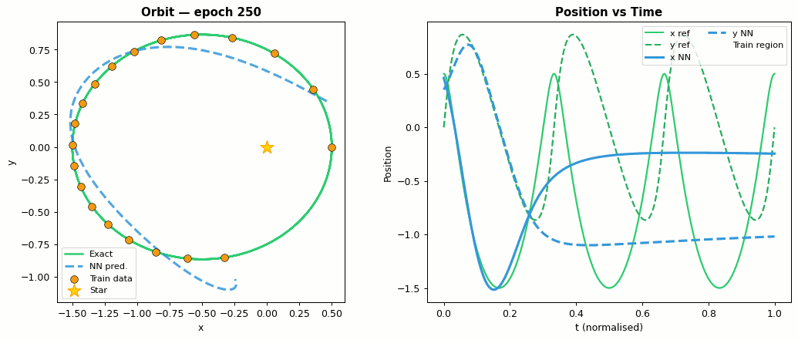

# 🪐 Physics-Informed Neural Network — Kepler Orbit Reconstruction

<p align="center">
  
</p>

<p align="center">
  <a href="https://swarnadeepseth.github.io/kepler_PINN.html"></a>
  <a href="https://github.com/SwarnadeepSeth/Physics_Informed_NN-Kepler"></a>
  
  
  
  
</p>

---

## 🌌 Overview

This project applies **Physics-Informed Neural Networks (PINNs)** and **Hamiltonian Neural Networks (HNNs)** to reconstruct a **Kepler elliptical orbit** from sparse observational data — using Newton's law of gravitation as a physics constraint.

**Problem Statement:**  
> A satellite is observed for only **~27 points out of 1000**. Can a neural network predict the full trajectory?

| Method | Key idea | Extrapolates? |
|--------|----------|--------------|
| ❌ **Standard NN** | Data only, no physics | Diverges |
| ⚠️ **Improved PINN** | Data + Newton ODE residual + IC loss | Partial |
| ✅ **Hamiltonian NN** | Learns conserved Hamiltonian $H(q,p)$ directly | Best extrapolation |

---

## 🔭 The Physics

The two-body gravitational problem in dimensionless units ($GM = 1$):

$$\ddot{x} = -\frac{GM \cdot x}{r^3}, \qquad \ddot{y} = -\frac{GM \cdot y}{r^3}, \qquad r = \sqrt{x^2 + y^2}$$

This system has two conserved quantities (Kepler's laws):

$$E = \frac{1}{2}(v_x^2 + v_y^2) - \frac{GM}{r} = \text{const} \quad \text{(energy)}$$
$$L = x v_y - y v_x = \text{const} \quad \text{(angular momentum — Kepler's 2nd law)}$$

---

## 🧠 PINN Loss Function

$$\mathcal{L}_{\text{total}} = \underbrace{\frac{1}{N}\sum_{i}\left[(\hat{x}(t_i)-x_i)^2 + (\hat{y}(t_i)-y_i)^2\right]}_{\text{data loss}} + \lambda_{\text{phys}} \underbrace{\frac{1}{M}\sum_{j}\left[\left(\ddot{\hat{x}} + \frac{GM\hat{x}}{r^3}\right)^2 + \left(\ddot{\hat{y}} + \frac{GM\hat{y}}{r^3}\right)^2\right]}_{\text{physics (ODE residual) loss}} + \lambda_{\text{IC}} \underbrace{\sum_{k}\left(\hat{x}(0)-x_0\right)^2 + \ldots}_{\text{IC loss}}$$

Second derivatives $\ddot{\hat{x}}, \ddot{\hat{y}}$ are computed via **PyTorch autograd** — fully differentiable end-to-end.

## ⚛️ Hamiltonian Neural Network

HNN learns the Hamiltonian $H(x,y,p_x,p_y)$ directly, then evolves via Hamilton's equations:

$$\dot{x} = \frac{\partial H}{\partial p_x}, \quad \dot{p}_x = -\frac{\partial H}{\partial x}, \quad \dot{y} = \frac{\partial H}{\partial p_y}, \quad \dot{p}_y = -\frac{\partial H}{\partial y}$$

This construction **guarantees energy conservation by design** via a symplectic integration step.

---

## 🗂️ Repository Structure

```
Physics_Informed_NN-Kepler-main/
├── Kepler_PINN_Walkthrough.ipynb   ← 📓 Comprehensive Jupyter notebook (NN + PINN + HNN)
├── Kepler_PINN.py                  ← 🐍 Standalone Python script
├── plots/                          ← 📊 Generated comparison plots
├── nn_kepler.gif                   ← Standard NN training animation
├── pinn_kepler.gif                 ← PINN training animation
└── README.md
```

---

## 🚀 Quick Start

### 1. Install dependencies
```bash
pip install torch numpy scipy matplotlib pillow jupyter
```

### 2. Run the Python script
```bash
mkdir -p plots
python Kepler_PINN.py
```

### 3. Explore the Jupyter notebook
```bash
jupyter notebook Kepler_PINN_Walkthrough.ipynb
```

---

## 📊 Results at a Glance

> Orbital eccentricity e = 0.5, training on 27/1000 points, extrapolation over 1.5 orbital periods.

| Method | Train MAE | Extrapolation MAE | Energy drift \|ΔE\| | Ang. mom. drift \|ΔL\| |
|--------|-----------|-------------------|---------------------|------------------------|
| Standard NN | 0.00130 | 1.18790 ❌ | 0.205 | 0.686 |
| Improved PINN | 0.97534 | 2.79413 ⚠️ | 0.254 | 0.116 |
| **HNN 🏆** | **0.00953** | **1.04312** ✅ | **—†** | **0.458** |

> †HNN learns $H_{\text{NN}}$ which is exactly conserved by construction; it does not equal the physical energy $E$ directly, so drift is not meaningful to compare.

> **Why does PINN have high Train MAE?** The IC loss ($\lambda_{\text{IC}}=10$) and physics loss ($\lambda_{\text{phys}}=1$) deliberately dominate — the network prioritises satisfying the ODE over fitting data, which is the correct PINN philosophy for sparse/noisy data.

<p align="center">
  
  &nbsp;
  
</p>
<p align="center"><em>Left: Standard NN (extrapolation diverges) &nbsp;|&nbsp; Right: Improved PINN (physics-guided)</em></p>

<p align="center">
  
</p>

---

## ⚙️ Network Architecture

```
Input (t) → Linear(1→64) → Tanh
          → Linear(64→64) → Tanh   × 3 hidden layers
          → Linear(64→2)           ← outputs (x, y)
```

- **Input:** scalar time $t$
- **Output:** 2D position $(x(t),\; y(t))$
- **Activation:** Tanh (smooth, differentiable for 2nd-order autograd)
- **Physics collocation points:** 50 uniform points across full time domain
- **Physics weight $\lambda$:** $10^{-3}$

---

## 📓 Notebook Contents

The `Kepler_PINN_Walkthrough.ipynb` notebook covers:

1. 🌌 Introduction & motivation (why PINNs for orbital mechanics?)
2. 🔭 Kepler's three laws & orbital mechanics background
3. 📐 Governing equations: Newton's gravity (2D coupled ODE system)
4. 📊 Analytical solution & numerical reference with `scipy.odeint`
5. ⚡ Energy & angular momentum conservation checks
6. 🧠 Standard NN baseline — architecture, training, failure in extrapolation
7. 🚀 Improved PINN — 5 key fixes: IC loss, physics weight, collocation density, normalised time, energy regularisation
8. ⚛️ Hamiltonian Neural Networks — learning $H(q,p)$, symplectic integration, guaranteed conservation
9. 📈 Loss convergence curves for all three methods
10. 🔍 Quantitative comparison table (Train MAE / Extrapolation MAE / conservation)
11. 🎬 Inline training animations (NN and PINN)
12. 🏁 Conclusions & research directions

---

## 📐 Physical Parameters

| Parameter | Value |
|-----------|-------|
| Gravitational parameter $GM$ | 1.0 (dimensionless) |
| Semi-major axis $a$ | 1.0 |
| Eccentricity $e$ | 0.5 |
| Orbital period $T$ | $2\pi \approx 6.28$ |
| Simulation time | $1.5 T$ |
| Training data | Sparse points from first 40% |

---

## 🔗 References

- Raissi, M., Perdikaris, P., Karniadakis, G.E. (2019). [Physics-informed neural networks](https://www.sciencedirect.com/science/article/pii/S0021999118307125). *Journal of Computational Physics.*
- Greydanus, S. et al. (2019). [Hamiltonian Neural Networks](https://arxiv.org/abs/1906.01563). *NeurIPS.*
- Cranmer, M. et al. (2020). [Lagrangian Neural Networks](https://arxiv.org/abs/2003.04630).

---

## 🔗 Related Projects

- [Pendulum PINN](../Physics_Informed_NN-Pendulum-main/) — PINN for nonlinear simple pendulum ODE

---

<p align="center">Made with ❤️ by <a href="https://swarnadeepseth.github.io">Swarnadeep Seth</a></p>
